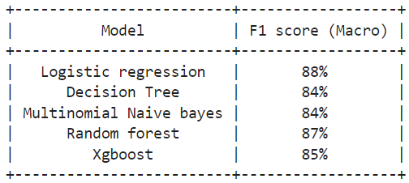
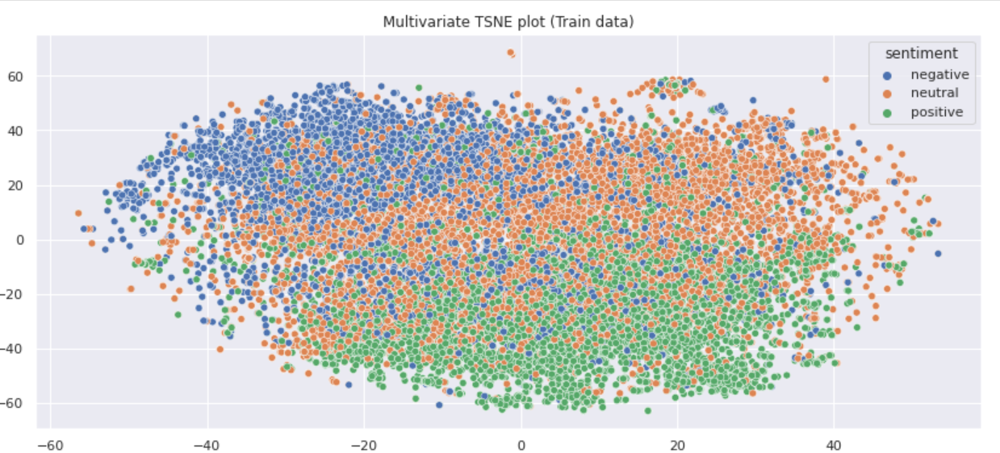

# TWITTER SENTIMENT ANALYSIS ML APP

### Final Performance on unseen test data:

### Note: (ML-appstreamlit mp4 video)
In this project, I have created a model to predict the sentiment of a given tweet and also deployed the same using Streamlit.
Due to the heavy memory consumption and large pickle files >>25mb, the heroku does not process the vectorizing of the data and results are not obtained . Hence I request you to watch the ML-appstreamlit mp4 video where i ran the app successfully using local host.

In this comprehensive data science project, I developed a robust sentiment classification model to analyze Twitter data, categorizing tweets into Negative, Neutral, and Positive sentiments with high precision and recall. Key highlights include:

Data Preparation: Processed a large dataset of tweets, ensuring data integrity by removing duplicates, handling missing values, and performing thorough text cleaning for a noise-free analysis.

Exploratory Data Analysis (EDA): Conducted distribution analysis of target sentiments to address class imbalances, enhancing understanding of the dataset through visualizations.

Model Development: Implemented and compared multiple classification models, including Logistic Regression, Decision Trees, Multinomial Naive Bayes, Random Forest, and XGBoost, achieving impressive F1 scores (88% for Logistic Regression, 87% for Random Forest).

Performance Metric Selection: Chose the F1 score as the primary evaluation metric to balance precision and recall, providing a reliable measure of model performance in sentiment classification.

Advanced Techniques: Explored deep learning with TensorFlow for a Bidirectional LSTM model, achieving an F1 score of 84%.

This project sharpened my skills in data cleaning, exploratory analysis, and model development, positioning me as a strong candidate for data science roles.

### Visualizing high dimensional data:

